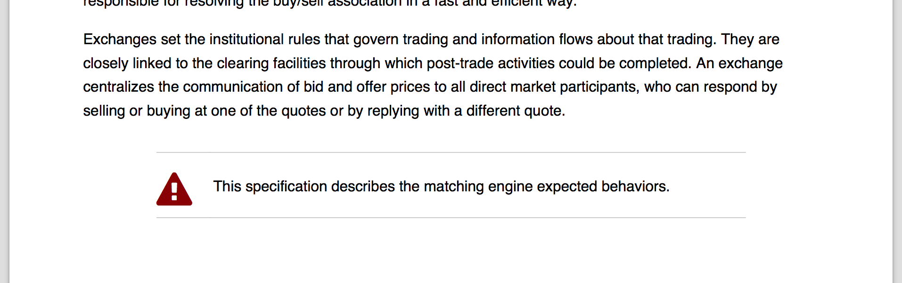
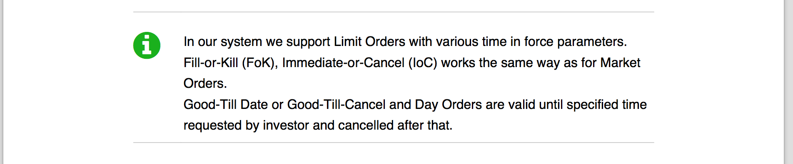
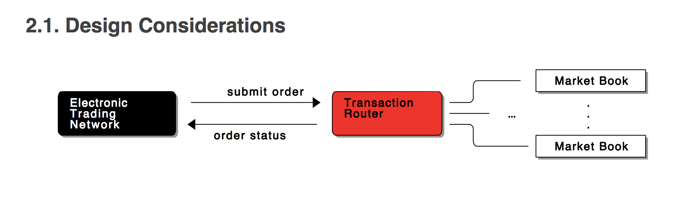
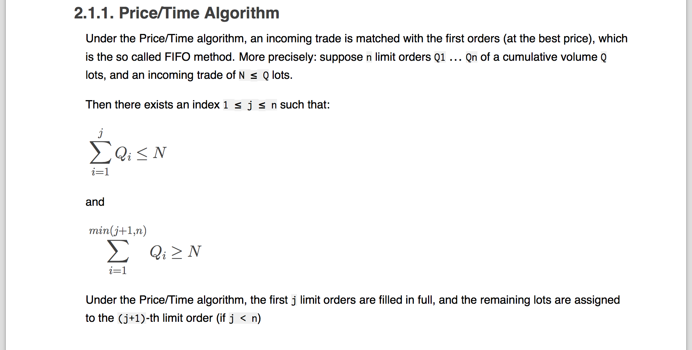

tzatziki
--------

* [Getting started](#getting-started)
  * [Maven dependency](#maven-dependency)
  * [First generate the execution report](#first-generate-the-execution-report)
  * [Generate a report based on the execution file](#generate-a-report-based-on-the-execution-file)
  * [Plug everything together](#plug-everything-together)
* [A simple preamble](#a-simple-preamble)
* [A feature file](#a-feature-file)
* [Extended markdown](#extended-markdown)
* [Test settings](#test-settings)
* [Tag Dictionary](#tag-dictionary)
  * [Add a sanity check on tags](#add-a-sanity-check-on-tags)


A complete example of a pdf report generated using tzatziki can be found here [Sample PDF](doc/sample-yamex-report.pdf)


## Getting started

### Maven dependency

Last released version: `0.14.0`

**For pdf reporting:**

```
        <dependency>
            <groupId>org.technbolts.tzatziki</groupId>
            <artifactId>tzatziki-pdf</artifactId>
            <version>${tzatziki.version}</version>
        </dependency>
```


### First generate the execution report

This can be achieved by adding the tzatziki reporter that will track all information during cucumber execution.
Reporter will then create an execution file: `target/myapp/exec.json`

```java

import cucumber.api.CucumberOptions;
import cucumber.api.junit.Cucumber;
import org.junit.runner.RunWith;

@RunWith(Cucumber.class)
@CucumberOptions(
        strict = true,
        tags = {"~@wip", "~@notImplemented"},
        format = "tzatziki.analysis.exec.gson.JsonEmitterReport:target/myapp")
public class RunAllFeatures {
}

```

### Generate a report based on the execution file

Whereas this may seem a bit complicated, this is actually really simple.

1. Read the execution file (`myapp/exec.json`) back to the tzatziki model of execution (`List<FeatureExec>`)
2. Indicate the output file; (see [TestSettings](#test-settings))
3. Configure the report using the basic builder
    * declare the `imageDir` variable used in the markdown image path definition (see [preamble.md](#a-simple-preamble-md)); this will be replaced within markdown file to complete image path. You can use whatever variable name you want
    * Main title of the report and its sub-title; they only appear in the default first page renderer

Then in order, the following content will be included in the document:

1. Include the markdown file named `preamble.md`
2. All features
3. Sample steps used as a legend for icon

```java
package myapp.feature;

import com.itextpdf.text.DocumentException;
import gutenberg.itext.FontModifier;
import gutenberg.itext.Styles;
import gutenberg.itext.model.Markdown;
import org.apache.commons.io.IOUtils;
import tzatziki.analysis.exec.gson.JsonIO;
import tzatziki.analysis.exec.model.FeatureExec;
import tzatziki.pdf.support.Configuration;
import tzatziki.pdf.support.DefaultPdfReportBuilder;
import myapp.TestSettings;

import java.io.File;
import java.io.FileInputStream;
import java.io.IOException;
import java.io.InputStream;
import java.util.List;

/**
 * @author <a href="http://twitter.com/aloyer">@aloyer</a>
 */
public class PdfSimpleReport {
    public void generate() throws IOException, DocumentException {
        List<FeatureExec> execs = loadExec(new File(buildDir(), "myapp/exec.json"));

        File fileOut = new File(buildDir(), "myapp/report.pdf");

        new DefaultPdfReportBuilder()
                .using(new Configuration()
                                .displayFeatureTags(true)
                                .displayScenarioTags(true)
                                .declareProperty("imageDir",
                                        new File(baseDir(), "/src/test/resources/myapp/feature/images").toURI().toString())
                                .adjustFont(Styles.TABLE_HEADER_FONT, new FontModifier().size(10.0f))
                )
                .title("myapp")
                .subTitle("Technical & Functional specifications")
                .markup(Markdown.fromUTF8Resource("/myapp/feature/preamble.md"))
                .features(execs)
                .sampleSteps()
                .generate(fileOut);
    }

    private static File buildDir() {
        String baseDir = new TestSettings().getBuildDir();
        return new File(baseDir);
    }

    private static File baseDir() {
        String baseDir = new TestSettings().getBaseDir();
        return new File(baseDir);
    }

    private static List<FeatureExec> loadExec(File file) throws IOException {
        InputStream in = null;
        try {
            in = new FileInputStream(file);
            return new JsonIO().load(in);
        } finally {
            IOUtils.closeQuietly(in);
        }
    }
}
```

### Plug everything together

The simpler way to plug everything together is to use junit suite:

Once cucumber is done, trigger the report generation (`@AfterClass`)


```java
import org.junit.AfterClass;
import org.junit.runner.RunWith;
import org.junit.runners.Suite;

/**
 * @author <a href="http://twitter.com/aloyer">@aloyer</a>
 */
@RunWith(Suite.class)
@Suite.SuiteClasses({RunAllFeatures.class})
public class RunAllFeatureAndGenerateReportTest {

    @AfterClass
    public static void generateExecutionReport() throws Exception {
        new PdfSimpleReport().generate();
    }
}
```


## A more advanced report

TODO


## A simple preamble


This preamble illustrate several markdown enhancement supported by tzatziki (though [gutenberg](https://github.com/Arnauld/gutenberg)).


```markdown
    # Welcome to Yamex!

    

    Yamex is the next-gen market exchange engine that will probably drives all EURO, AMER and ASIA trading platform.

    A central part of a market exchange engine is the matching engine.
    A matching engine is a program that accepts orders from buyers and sellers. The other matching module matches buy and sell orders, creates transactions to record the process, and updates the customers account balances.

    The matching (or trade allocation) algorithm is an important part of an exchange trading mechanism, since it is responsible for resolving the buy/sell association in a fast and efficient way.

    Exchanges set the institutional rules that govern trading and information flows about that trading. They are closely linked to the clearing facilities through which post-trade activities could be completed. An exchange centralizes the communication of bid and offer prices to all direct market participants, who can respond by selling or buying at one of the quotes or by replying with a different quote.

    {icon=warning,icon-color=dark-red}
    G> This specification describes the matching engine expected behaviors.

    # Terminology

    * **Order** - An order is an instruction to buy or sell a stock at a specific price or better
    * **Bid** - the price in a buy order
    * **Ask** - the price in a sell order
    * **Spread** - the difference between the bid and the ask
    * **Time In Force** - indicates how long an order will remain active (see Appendix B)


    ## Design Considerations

    ```ditaa
                                                                 +-------------+
                                                         /------ | Market Book |
    /--------------\     submit order  /-------------\   |       +-------------+
    | Electronic   | ----------------> | Transaction |---/              .
    | Trading      |                   | Router      |------ ...        .
    | Network cBLK | <---------------- |        cRED |---\              .
    \--------------/   order status    \-------------/   |       +-------------+
                                                         \-------| Market Book |
                                                                 +-------------+
    ```

    ### Price/Time Algorithm

    Under the Price/Time algorithm, an incoming trade is matched with the first orders (at the best price), which is the so called FIFO method.
    More precisely: suppose `n` limit orders `Q1` ... `Qn` of a cumulative volume `Q` lots, and an incoming trade of `N ≤ Q` lots.

    Then there exists an index `1 ≤ j ≤ n` such that:

    ```formula
    \sum\limits_{i=1}^j Q_i \leq N
    ```

    and

    ```formula
    \sum\limits_{i=1}^{min(j+1,n)} Q_i \geq N
    ```

    Under the Price/Time algorithm, the first `j` limit orders are filled in full, and the remaining lots are assigned to the `(j+1)`-th limit order (if `j < n`)
```

## A Feature File

Due to cucumber issue while parsing markdown (`*` is a bullet in markdown but considered as a step in cucumber);
the easiest way to include markdown within your scenario is to comment them.
Double comment (`##`) can then be used to comment out information that won't be rendered in the final report.

You can note several extensions within the markdown:

* [Icon based block](#icon-based-block)

```
   #{icon=info-circle, icon-color=#00b200}
   #G> In our system we support Limit Orders with various time in force parameters.
   #G> Fill-or-Kill (FoK), Immediate-or-Cancel (IoC) works the same way as for Market Orders.
   #G> Good-Till Date or Good-Till-Cancel and Day Orders are valid until specified time
   #G> requested by investor and cancelled after that.
```

* [Syntax highlighting](#syntax-highlighting)

```
   #```cucumber
   #  Given an order book containing two sell orders: 15@10.4 by B1 and 150@11.9 by B2
   #  When a buy order is placed 20@10.4 by BBuyer
   #  Then the buy order should remain in the order book with the remaining quantity of 5@10.4
   #  But an execution should have been triggered: [B1->BBuyer 15@10.4]
   #```
```


```gherkin
Feature: Limit Order

#  A limit order is an order to buy or sell a contract at a specific price or better.
#
#  A **buy** limit order can only be executed at the **limit price or lower**, and
#  a **sell** limit order can only be executed at the **limit price or higher**.
#
#  Use of a Limit order helps ensure that the customer will not receive an execution
#  at a price less favorable than the limit price. Use of a Limit order, however,
#  does not guarantee an execution.
#
#  * A buy limit order for FFLY at $125 will buy shares of FFLY at $125 or less.
#  * A sell limit order for FFLY at $125 will sell shares of FFLY for $125 or more.
#  * A limit order must have a Time in Force (TIF) value
#
#{icon=info-circle, icon-color=#00b200}
#G> In our system we support Limit Orders with various time in force parameters.
#G> Fill-or-Kill (FoK), Immediate-or-Cancel (IoC) works the same way as for Market Orders.
#G> Good-Till Date or Good-Till-Cancel and Day Orders are valid until specified time
#G> requested by investor and cancelled after that.

  @limitOrder @placeOrder
  Scenario: Place a Buy Limit Order

    Given an empty order book
    When a limit order is placed to buy 150 FFLY at 10.4€
    Then the order book should be updated with this new order

  @orderBook @bestPrices @limitOrder @stopOrder
  Scenario: Best ask price - limit orders and stop orders

    #{icon=warning, icon-color=dark-red}
    #G>  Stop order should not be taken into account for best price.
    #

    Given an empty order book
    And the following orders have been placed:
      | instrument | order type  | way  | qty | price |
      | FFLY       | Stop Order  | Sell | 150 | 10.1  |
      | FFLY       | Limit Order | Sell | 150 | 11.9  |
      | FFLY       | Limit Order | Sell | 15  | 10.4  |
      | FFLY       | Limit Order | Buy  | 15  | 10.0  |
    Then the order book's best ask price should be 10.4€

  @orderBook @matchingPrinciple @limitOrder
  Scenario: Matching a Buy order partially - exact same price

    #
    # Order book contains already two sell orders.
    #
    # The buy order triggered is not fully fulfilled, thus remains in the order book but with only the missing quantity.
    #
    # But an execution is triggered for the partial fulfillment
    #
    # **Alternate scenario?**
    #
    #{width:100%}
    #```cucumber
    #  Given an order book containing two sell orders: 15@10.4 by B1 and 150@11.9 by B2
    #  When a buy order is placed 20@10.4 by BBuyer
    #  Then the buy order should remain in the order book with the remaining quantity of 5@10.4
    #  But an execution should have been triggered: [B1->BBuyer 15@10.4]
    #```

    Given an empty order book
    And the following orders have been placed:
      | Broker | order type  | way  | qty | price |
      | B1     | Limit Order | Sell | 15  | 10.4  |
      | B2     | Limit Order | Sell | 150 | 11.9  |
    When a limit order is placed to buy 20 FFLY at 10.4€ by "Broker-A"

    Then the order book should be composed of the following orders:
      | Broker   | order type  | way  | qty | price |
      | Broker-A | Limit Order | Buy  | 5   | 10.4  |
      | B2       | Limit Order | Sell | 150 | 11.9  |
    And the following execution should have been triggered:
      | seller broker | buyer broker | qty | price |
      | B1            | Broker-A     | 15  | 10.4  |

```

## Extended markdown

* [variable reference in URL](variable-reference-in-url)
* [Icon based block](#icon-based-block)
* [Syntax highlighting](#syntax-highlighting)
* [Ditaa support](#ditaa-support)
* [Math LateX support](#math-latex-support)

### variable reference in URL

e.g. `${imageDir}` in ``

### Icon based block

```
  {icon=warning,icon-color=dark-red}
  G> This specification describes the matching engine expected behaviors.
```

is rendered as:



```
  #{icon=info-circle, icon-color=#00b200}
  #G> In our system we support Limit Orders with various time in force parameters.
  #G> Fill-or-Kill (FoK), Immediate-or-Cancel (IoC) works the same way as for Market Orders.
  #G> Good-Till Date or Good-Till-Cancel and Day Orders are valid until specified time
  #G> requested by investor and cancelled after that.
```

is rendered as:




List of available icons can be found here: [Font-Awesome](http://fortawesome.github.io/Font-Awesome/icons/)

### Syntax highlighting

Code blocks can be taken a step further by adding syntax highlighting.
In your fenced block, add an optional language identifier and we'll run it through syntax highlighting.

Currently supported language are available here: [Pygments](http://pygments.org/languages/)

### Ditaa support

[Ditaa](http://ditaa.sourceforge.net/) block is also supported as an extra language;
it can be triggered using the triple ticks block marker followed by the `ditaa` language.

```
    ```ditaa
                                                                     +-------------+
                                                             /------ | Market Book |
        /--------------\     submit order  /-------------\   |       +-------------+
        | Electronic   | ----------------> | Transaction |---/              .
        | Trading      |                   | Router      |------ ...        .
        | Network cBLK | <---------------- |        cRED |---\              .
        \--------------/   order status    \-------------/   |       +-------------+
                                                             \-------| Market Book |
                                                                     +-------------+
    ```
```

is rendered as:




### Math LateX support

[JLatexMath](http://forge.scilab.org/index.php/p/jlatexmath/) block is also supported as an extra language;
it can be triggered using the triple ticks block marker followed by the `formula` language.


```
    ```formula
    \sum\limits_{i=1}^{min(j+1,n)} Q_i \geq N
    ```
```

is rendered as:




## Test settings

Simply provide settings, project directory, resource path and so on...

The snippet provided are a basic usage of both property file and maven resource filtering.

`myapp/test-settings.properties`

```
buildDir=${project.build.directory}
baseDir=${project.basedir}
```


`pom.xml`

```xml
<?xml version="1.0" encoding="UTF-8"?>
<project xmlns="http://maven.apache.org/POM/4.0.0" xmlns:xsi="http://www.w3.org/2001/XMLSchema-instance"
         xsi:schemaLocation="http://maven.apache.org/POM/4.0.0 http://maven.apache.org/xsd/maven-4.0.0.xsd">

    ...

    <build>
        <testResources>
            <testResource>
                <directory>src/test/resources</directory>
                <filtering>true</filtering>
                <includes>
                    <include>**/*.properties</include>
                </includes>
            </testResource>
            <testResource>
                <directory>src/test/resources</directory>
                <filtering>false</filtering>
                <excludes>
                    <exclude>**/*.properties</exclude>
                </excludes>
            </testResource>
        </testResources>

        ...

    </build>
</project>
```

`myapp.TestSettings`

```java
public class TestSettings {

    private Properties properties;

    public TestSettings() {
    }

    public String getBuildDir() {
        return getProperties().getProperty("buildDir");
    }

    public String getBaseDir() {
        return getProperties().getProperty("baseDir");
    }

    public Properties getProperties() {
        if (properties == null) {
            properties = new Properties();
            InputStream stream = null;
            try {
                stream = getClass().getResourceAsStream("/myapp/test-settings.properties");
                properties.load(stream);
            } catch (IOException e) {
                throw new RuntimeException("Failed to open settings", e);
            } finally {
                IOUtils.closeQuietly(stream);
            }
        }
        return properties;
    }
}
```

## Tag Dictionary

By using a tag dictionary, you can ensure everyone is using the same tags.
Checks can also be easily added to ensure only tags defined within the dictionary are used within the feature files.
This prevents misspell by raising an error.

An example of `tags.properties`

```INI
wip=Work in progress
notImplemented=Behavior not implemented

default=Define standard and predefined objects with basic characteristics (e.g. limit order...)

orderBook=Order Book

limitOrder=Limit Order
marketOrder=Market Order
stopOrder=Stop 'Loss' Order

timeInForce=Time In Force

placeOrder=Order placed in order book
bestPrices=Order book query to retrieve actual best prices (best bid or ask)
cumulativeView=Order book cumulative view
matchingPrinciple=Order book's Matching principles

```

### Add a sanity check on tags

```java

import org.junit.runner.RunWith;
import samples.TestSettings;
import tzatziki.analysis.step.Features;
import tzatziki.analysis.tag.TagDictionary;
import tzatziki.junit.SanityTagChecker;

import java.io.File;

import static tzatziki.junit.SanityTagChecker.loadFeaturesFromSourceDirectory;

/**
 * @author <a href="http://twitter.com/aloyer">@aloyer</a>
 */
@RunWith(SanityTagChecker.class)
public class CoffeeMachineTagCheckTest {

    @SanityTagChecker.TagDictionaryProvider
    public static TagDictionary tagDictionary() {
        return new TagDictionary()
                .declareTag("@wip")
                .declareTag("@protocol")
                .declareTag("@notification")
                .declareTag("@message")
                .declareTag("@runningOut")
                .declareTag("@coffee")
                .declareTag("@tea")
                .declareTag("@chocolate")
                .declareTag("@sugar")
                .declareTag("@noSugar")
                .declareTag("@takeOrder")
                .declareTag("@payment")
                .declareTag("@reporting")
                .declareTag("@manual")
                ;
    }

    @SanityTagChecker.FeaturesProvider
    public static Features features() {
        String basedir = new TestSettings().getBaseDir();
        return loadFeaturesFromSourceDirectory(new File(basedir, "src/main/resources/samples/coffeemachine"));
    }
}
```


